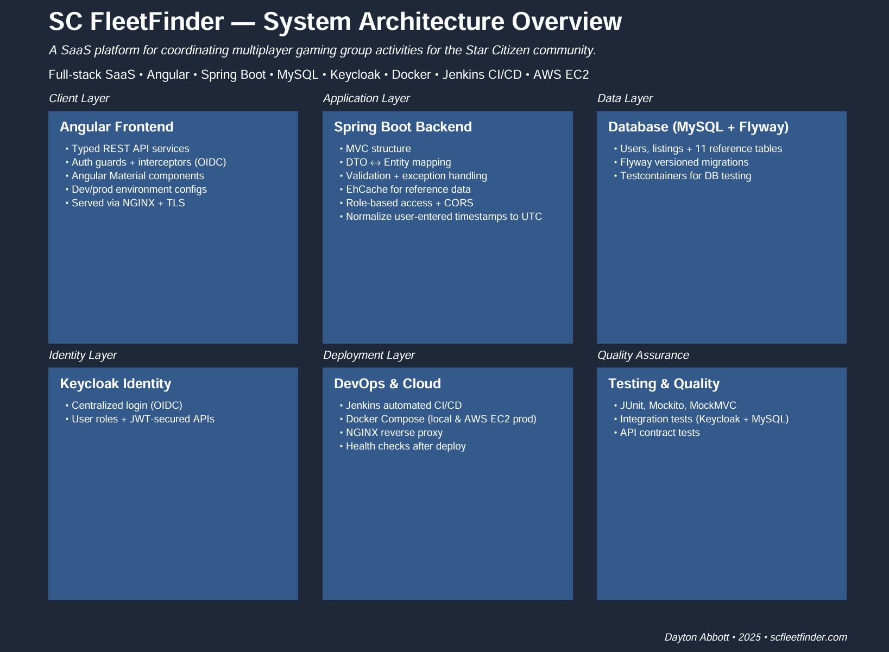

# SC FleetFinder

FleetFinder is a full-stack web app that helps players of the MMO *Star Citizen* find and join gameplay groups 
based on shared interests.

> **Version:** v1.0.1  
> Current focus: User profile UI, role-based access for content moderation, listing view table refactor + search and filter

---

## What is FleetFinder?

FleetFinder is a companion app for the MMO video game *Star Citizen*, a space simulation game developed by Cloud 
Imperium Games. As the game is still in alpha and lacks a built-in group finder, FleetFinder helps players find and connect
with other players seeking similar gameplay. For development details and an architecture overview, checkout 
https://scfleetfinder.com/about

---

## Why I Built This

This project allows me to apply and expand my software development skills beyond my CS coursework at WGU. It solves a 
real problem for *Star Citizen* players while helping me grow as a fullstack developer.

---

## Tech Stack

### Backend
- Java 22
- Spring Boot (REST APIs, caching, dependency injection)
- Spring Data JPA
- Maven

### Frontend
- Angular 19
- TypeScript
- Bootstrap, HTML/CSS

### Database
- MySQL 8.2
- MySQL Workbench
- Flyway for DB migrations

### Testing
- JUnit 5, Spring Boot Test
- Mockito, MockMVC
- Postman

### Identity
- Centralized login with OIDC
- Keycloak (IAM)
- JWT secured APIs

### Deployment / DevOps
- Docker & Docker Compose
- AWS (EC2 or other hosting)
- Flyway for DB migrations
- Jenkins (CI/CD)
- NGINX reverse proxy

### Supporting Libraries
- Lombok
- ModelMapper
- EhCache
- dotenv (env var management)
- SLF4J + Logback (logging)

### Planned Integrations
- RabbitMQ (async message handling)
- WebSockets (real-time chat and notifications)

---

## FleetFinder v1 (Previous Release)

**Version 1** includes the core CRUD functionality:

- MySQL database with group listings and static lookup tables
- Spring Boot backend with RESTful APIs
- Angular frontend with reactive forms and a listing table
- Responsive layout for different screen sizes
- Unit + integration tests for services, controllers, and mappers

## FleetFinder v1.1 (Current)

**Version 1.1** expands the core features to include user authentication and role-based access.
- Jenkins CI/CD pipeline to run automated tests, build images, push to ECR, and deploy new containers in AWS EC2
- Keycloak integration with MySQL database
- Separate Docker container for Keycloak
- Role-based access for listing creation and user account pages
- Account page for viewing profile info and the user's current listings
- Separate public and private response DTOs for user objects with different method parameters for access
- Additional backend tests for User API endpoints for create user and user auth check

---

## Roadmap

### Coming in v2 (MVP)
- Role-based access for content moderation
- Listing view table search/filter functionality
- Real-time messaging between users with RabbitMQ for async communication and WebSockets for alerts

### Planned Post-MVP Features
- Save listing templates
- Bookmark listings of interest
- Google Perspective API integration for automated content moderation
- User profile updates/customization
- Analytics for listing trends

---

## Contributing/Contact

This is a personal portfolio project and not currently open for contributions, but feel free to reach out with 
feedback or questions!

---

## License

SC FleetFinder is licensed under the GNU General Public License v3.0.
See the [LICENSE](./LICENSE) file for details.